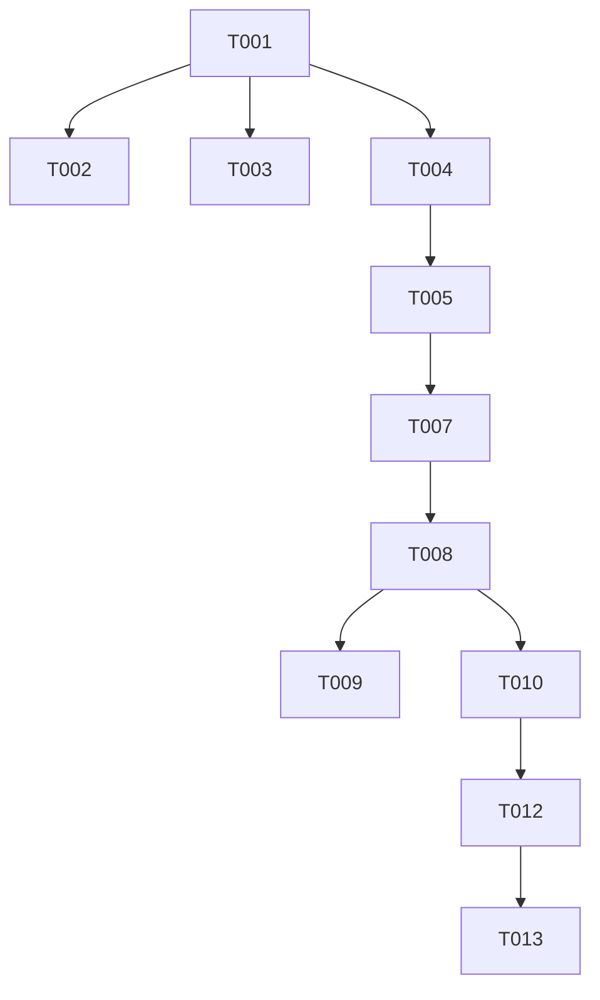

# Feature Tasks: Require Authentication

**Feature Branch**: `005-require-auth`  
**Feature Spec**: [Spec](/specs/005-require-auth/spec.md) | [Plan](/specs/005-require-auth/plan.md)

## Phase 1: Setup

- [x] T001 Implement `startSession(user)` and `endSession()` utilities in `src/lib/auth/session.ts` to manage the `__session` cookie.
- [x] T002 Update `src/app/login/page.tsx` (and component) to call `startSession` on successful login before redirecting.
- [x] T003 Update existing logout/signout button (e.g. in `TopNav` or `Sidebar`) to call `endSession` and clear cookies.

## Phase 2: Foundational (Blocking)

- [x] T004 Create `src/middleware.ts` to check for `__session` cookie on protected routes.
- [x] T005 [P] Configure middleware matcher to protect `/app/:path*` and redirect to `/login`.
- [x] T006 [P] Configure middleware to redirect authenticated users (with cookie) from `/login` to `/app`.

## Phase 3: User Story 1 - Require Authentication

*Goal: Ensure only authenticated users can access the application, while public users see the landing page.*

### Models
- N/A (Using existing User model)

### Services
- N/A (Middleware handles logic)

### Implementation
- [x] T007 [US1] Create `src/app/app/layout.tsx` to wrap the protected application.
    - *Implementation Note:* Move the `AuthProvider` and `MainLayout` wrapping logic here if it was previously global.
- [x] T008 [US1] Move all protected content pages (`dashboard`, `karts`, `teams`, `sessions`) into `src/app/app/`.
    - *Note:* Be careful to update imports in these files if they used relative paths.
- [x] T009 [US1] Create a public Landing Page at `src/app/page.tsx` (replacing the temporary redirect).
    - *Content:* Simple hero section with "Login" button.

### Integration
- [x] T010 [P] [US1] Update all hardcoded links in the codebase that pointed to `/` to now point to `/app` (e.g., Logo click, "Back to Dashboard" buttons).
    - *File:* `src/components/layout/TopNav.tsx`, `src/components/layout/Sidebar.tsx`, etc.

## Phase 4: User Story 2 - Persistent Session

*Goal: Ensure users stay logged in across reloads.*

### Implementation
- [x] T011 [US2] Verify `AuthProvider` in `src/components/providers/AuthProvider.tsx` correctly syncs with the cookie state if needed, or primarily relies on Firebase Auth's existing IndexedDB persistence.
    - *Note:* This task is a verification and potential tweak task. If `onAuthStateChanged` fires correctly, no code change might be needed, but we must ensure the `loading` state doesn't conflict with the middleware's "allowed" state.

## Final Phase: Polish

- [x] T012 Ensure the redirect from Middleware to Login includes a `?redirect=/app/original-path` parameter.
- [x] T013 Update Login page to respect the `redirect` query parameter after successful sign-in.
- [ ] T014 Run full E2E manual test of the auth flow (Login -> App -> Logout -> Landing). *Pending User Verification*
    - *Note:* Build is failing with a type error in generated files, but dev server should work for testing.

## Dependencies

## Parallel Execution Examples

- **Example 1**: T009 (Landing Page) can be built while T008 (Moving routes) is happening.
- **Example 2**: T010 (Updating links) can be done by a separate dev once the structure decision is final.

## Implementation Strategy

1. **Cookie Logic First**: We will implement the cookie setting logic first (T001-T003) so that we can manually test setting the cookie.
2. **Middleware Second**: We will add the middleware (T004-T006) which will effectively lock the app (or redirect loops if cookie logic is buggy).
3. **Restructure Third**: We will move the files (T007-T008) to their final home.
4. **Fix Links**: Finally update all navigation and polish.
